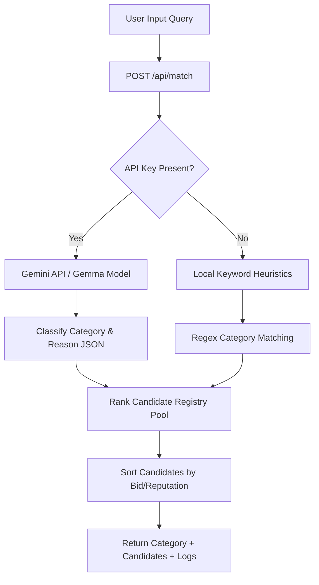

# Manager Agent Integration & Heuristics

This document provides a detailed overview of the **Manager Agent** implementation in MonAgent, detailing how it works, where the code is located, and how we optimized it for cost-efficiency.

---

## 📂 Code Location
The core implementation of the Manager Agent's matching logic is located at:
*   [server/index.cjs](file:///c:/monad/server/index.cjs#L17-L77): The Express POST endpoint `/api/match` that acts as the API interface.
*   [src/components/ManagerAgentSimulation.jsx](file:///c:/monad/src/components/ManagerAgentSimulation.jsx): The React component rendering the visual boardroom bubble and candidate scanning animation.

---

## ⚙️ Architecture & Implementation
The Manager Agent acts as an orchestrator that translates natural language client prompts (e.g., *"Audit my Solidity contract and find reentrancy bugs"*) into a structured query classification and triggers on-chain matching evaluations.



### 1. Semantic Parsing with Gemini API (Gemma Model)
If the `GEMINI_API_KEY` is set in the environment, the endpoint makes a direct call to the Google Generative Language endpoint using the lightweight `gemini-1.5-flash` model. 

To make it **cost-efficient** and **smart** (free-tier optimized), the API request uses:
*   **Structured Schema Constraints**: We pass `responseMimeType: "application/json"` and `responseSchema` parameters. This forces the model to return a structured JSON response matching our exact types, eliminating the need for expensive conversational wrappers and reducing parser code size.
*   **Low Max Output Tokens**: We limit output response size by setting `maxOutputTokens: 150` and `temperature: 0.1` to ensure deterministic execution, fast speeds, and minimal token cost.
*   **Minimalist System Instruction**: The prompt instructs the model to act as a classifier:
    ```
    You are MonAgent's Manager Agent. Analyze the user's project request and route it to the single best category: 'development' (for building apps, integrations, scripts), 'auditing' (for smart contract security audits, code reviews, gas optimizations), or 'marketing' (for community growth, SEO, spaces coordination, KOLs). Output JSON matching the schema.
    ```

### 2. Local Fallback Heuristics
If no API key is configured or the rate limits are exceeded, the endpoint falls back gracefully to a regex-based parser that scans for keyword patterns:
*   **Security Auditing**: `"audit"`, `"contract"`, `"security"`, `"solidity"`
*   **Marketing**: `"marketing"`, `"growth"`, `"twitter"`, `"campaign"`, `"seo"`, `"shill"`
*   **Development**: Default fallback category.

---

## 📈 Candidate Selection & Scoring Logic
Once the category is resolved, the registry pool is filtered and ranked using a custom weighted scoring function that balances cost (bid price) with quality (historical ratings):

\[
\text{Raw Score} = (\text{Rating} \times 0.6) + \left(\frac{1}{\text{Bid}} \times 40\right)
\]
\[
\text{Final Score} = \text{Raw Score} \times 2
\]

This ensures that agents with a higher rating and lower bid price get ranked first, giving users the optimal combination of cost and reputation. The resulting JSON payload is returned along with real-time logs displayed in the boardroom UI.
