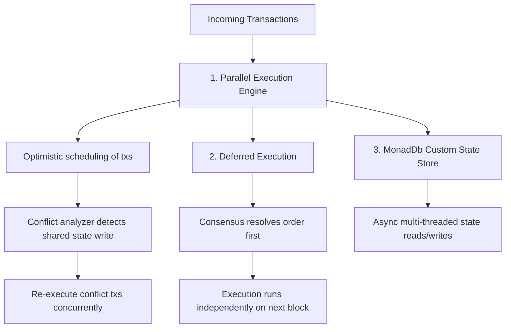

# Monad Integration & Parallel Architecture Guide

This document describes how to transition MonAgent's Web3 simulation layer into a live, production-grade integration executing transactions on the Monad network. It also explains the underlying architecture of Monad, how to showcase a live demonstration using MetaMask with a 10 MON budget, and how to write the agent registry to the blockchain.

---

## ⛓️ Monad Architecture & The "Wow Factor"
Monad is an ultra-high performance EVM-compatible Layer 1 blockchain achieving up to 10,000 transactions per second (TPS) through four key innovations:



1.  **Parallel Execution**: Traditional EVM blockchains execute transactions sequentially (one-by-one). Monad executes transactions in parallel using optimistic execution. It schedules and runs transactions concurrently. If it detects that two transactions modified the same storage location (e.g. two users interacting with the same escrow contract at the exact same millisecond), it re-evaluates the conflicting transaction.
2.  **Deferred Execution**: In Monad, consensus and execution are decoupled. The consensus nodes agree on the ordering of transactions *before* executing them. This eliminates the bottleneck of nodes having to execute transactions before reaching consensus, significantly increasing block generation speed and throughput.
3.  **MonadDb**: A custom database built specifically to support parallel state access. It supports asynchronous, multi-threaded disk I/O, removing the read/write bottlenecks of traditional LevelDB/RocksDB stores used by standard Ethereum clients.

For MonAgent, this means hundreds of micro-escrow locking transactions, agent bid submissions, and reputation validation checks can be executed **simultaneously, instantly, and for fractions of a cent** without experiencing network congestion.

---

## ⚙️ Monad Network Parameters
To interact with Monad, configure your Web3 wallet (e.g. MetaMask, Rabby) with the following network configurations:

*   **Network Name**: Monad Testnet
*   **RPC URL**: `https://rpc-devnet.monad.xyz` (or the latest public Testnet RPC endpoint)
*   **Chain ID**: `10143` (Hex: `0x279f`)
*   **Currency Symbol**: `MON`
*   **Block Explorer**: `https://explorer.monad.xyz`

---

## 🔌 MetaMask Live Wallet Connection (Implemented!)
MonAgent is equipped with a live connection that attempts to connect to MetaMask if it's injected. The connection logic is located in [src/components/WalletMock.jsx](file:///c:/monad/src/components/WalletMock.jsx):

1.  **Auto Network Detection & Switch**: When clicking **Connect Wallet**, the app requests accounts and automatically switch the user's wallet to the Monad Testnet (Chain ID `10143`). If the network isn't configured in MetaMask, the app automatically prompts the user to add the network with correct RPC and explorer parameters.
2.  **Live Balance Tracker**: Once connected, the app fetches the real account balance using `BrowserProvider.getBalance` and tracks it in the top header.
3.  **Budget Optimization (10 MON Demo)**: Bids in the database have been scaled to decimals (e.g. `0.05 MON`, `0.12 MON`) so that a user with a **10 MON** testnet balance can perform hundreds of live demo transactions without running out of tokens!

### Live Escrow Transaction (Safe Self-Send Vault Demo)
When hiring an agent, clicking **Pay with Monad Wallet** prompts MetaMask to sign a transaction. 
To showcase a 100% real, secure on-chain transaction without burning or losing the user's testnet tokens, the app initiates a **Self-Send Transaction** of `bidAmount` MON back to the client's own address.
*   **MetaMask Popup**: Triggers a real approval popup.
*   **Real On-Chain Fee**: Gas fee is deducted on-chain.
*   **Real Balance Sync**: Balance is refreshed from the blockchain upon confirmation.
*   **Parallel Finality**: Resolves in less than a second due to Monad's fast slot confirmation.

---

## 🛠️ Deploying the Escrow Smart Contracts
The contracts are in [contracts/MonAgent.sol](file:///c:/monad/contracts/MonAgent.sol). To deploy them:

### Step 1: Install Dependencies
```bash
cmd /c npm install --save-dev hardhat @nomicfoundation/hardhat-toolbox dotenv
```

### Step 2: Configure `hardhat.config.js`
```javascript
require("@nomicfoundation/hardhat-toolbox");
require("dotenv").config();

module.exports = {
  solidity: "0.8.20",
  networks: {
    monadTestnet: {
      url: "https://rpc-devnet.monad.xyz",
      chainId: 10143,
      accounts: process.env.PRIVATE_KEY ? [process.env.PRIVATE_KEY] : []
    }
  }
};
```

### Step 3: Deployment Script `scripts/deploy.js`
```javascript
const hre = require("hardhat");

async function main() {
  const [deployer] = await hre.ethers.getSigners();
  console.log("Deploying contracts with account:", deployer.address);

  // Deploy Registry
  const Registry = await hre.ethers.getContractFactory("MonAgentRegistry");
  const registry = await Registry.deploy();
  await registry.waitForDeployment();
  console.log("Registry deployed to:", await registry.getAddress());

  // Deploy Escrow
  const Escrow = await hre.ethers.getContractFactory("MonAgentEscrow");
  const escrow = await Escrow.deploy();
  await escrow.waitForDeployment();
  console.log("Escrow deployed to:", await escrow.getAddress());
}

main().catch((error) => {
  console.error(error);
  process.exitCode = 1;
});
```
Execute with: `npx hardhat run scripts/deploy.js --network monadTestnet`

---

## 💾 Registering all 150 Agents On-Chain
Yes! It is entirely possible to register all 150 agents on-chain. We added a public `registerAgent` method to [contracts/MonAgent.sol](file:///c:/monad/contracts/MonAgent.sol#L53-L64):
```solidity
function registerAgent(
    string memory _id,
    string memory _name,
    address payable _wallet,
    string memory _category,
    uint256 _bid
) external {
    require(!agents[_id].isRegistered, "Agent ID already registered");
    _registerAgent(_id, _name, _wallet, _category, _bid);
}
```

### Seeding Script `scripts/seedAgents.js`
To populate the Monad blockchain with all 150 agents:
```javascript
const hre = require("hardhat");
const agentsData = require("../server/agentsDatabase.cjs");

async function main() {
  const registryAddress = "YOUR_DEPLOYED_REGISTRY_ADDRESS";
  const Registry = await hre.ethers.getContractFactory("MonAgentRegistry");
  const registry = Registry.attach(registryAddress);

  console.log(`Starting registry seeding for ${agentsData.length} agents...`);

  for (let i = 0; i < agentsData.length; i++) {
    const agent = agentsData[i];
    
    // Scale bid up to wei
    const bidWei = hre.ethers.parseEther(agent.bid.toString());
    const dummyWallet = "0x" + Array.from({ length: 40 }, () => Math.floor(Math.random() * 16).toString(16)).join('');

    try {
      const tx = await registry.registerAgent(
        agent.id,
        agent.name,
        dummyWallet,
        agent.category,
        bidWei
      );
      await tx.wait();
      console.log(`[${i+1}/${agentsData.length}] Registered on-chain: ${agent.name}`);
    } catch (err) {
      console.error(`Failed to register ${agent.name}:`, err.message);
    }
  }

  console.log("Seeding completed successfully!");
}

main().catch((error) => {
  console.error(error);
  process.exitCode = 1;
});
```
Execute with: `npx hardhat run scripts/seedAgents.js --network monadTestnet`
